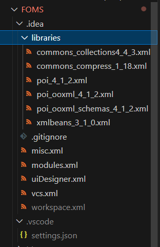
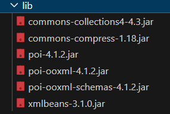
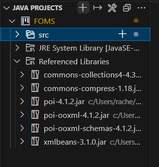

# Fastfood Ordering Management System (FOMS)

Tutorial Group: FDAB 
Group No.: Group 3

# Internal Workflow

## Collaboration with git

1. Create a new feature: create a branch from the main branch

2. Update the main branch with a new feature:
    1. Create a pull request from ur branch to the main branch.
    2. DON'T merge yet until ur sure ur code works when it merges (check with someone if ur unsure)

3. IMPT: update everyone when u make a new change to the GitHub repo (add branch/made a new commit/finish a test case etc)

4. Comment your code

## Weekly Meeting on Tues

1. Combine all changes and merge into main branch
2. Code Review (check quality of code)
3. Modify UML

## Modifications to UML

If you realise that changes have to be made to the UML diagram, indicate the changes under a table in the [UML Design](https://docs.google.com/document/d/1yI5BSaeG4VT24lCIhb6iy4oPa-R3GJikkPxK5FKEVwY/edit) docs. Then on our weekly meetings, we'll add all changes into the UML in the `main` branch.

## Load libraries in VSC

1. Enter the FOMS folder

2. You should have all these libraries under the .idea folder. 

3. Ensure all these libraries are under Java Projects > Referenced Libraries 